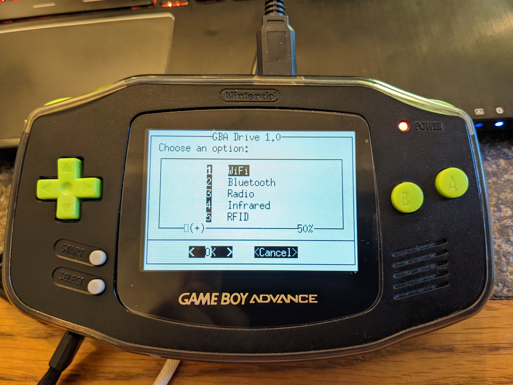
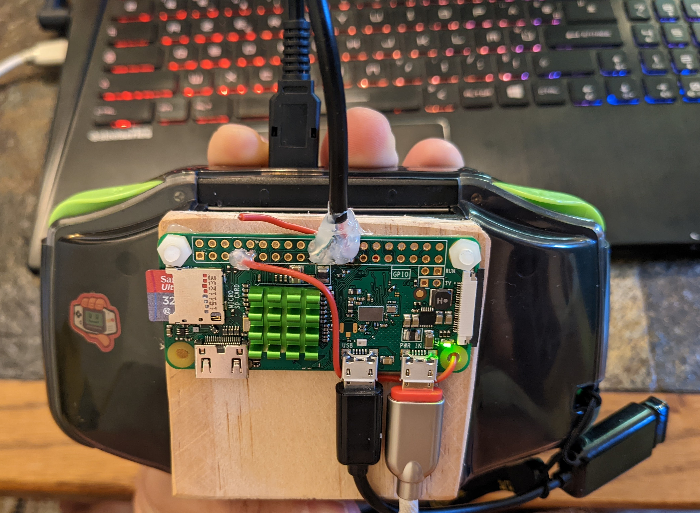

# GBA Drive

Hack stuff with your Game Boy !


🎮 GBA Drive is a tool which runs on a Raspberry Pi Zero W connected to a Game Boy Advance.  
Different wireless transceivers are connected to it in order to play with wireless protocols 🎮



## 🏹 Features

The beauty in the Game Boy Advance is that the console let you upload and run any code sent by the link cable. You can send a mini-game or data for multiplayer as intended, but you can also send any kind of code understandable by the GBA 😊 This feature let us upload code for streaming the Raspberry Pi screen on the GBA screen, and get the button hits in return.

Now we will use the ability of the Raspberry Pi Zero and the GBA screen and gamepad to play with wireless protocols, just like a handmade [Flipper Zero](https://flipperzero.one/) !


>The GBA Drive project is a gathering of many super cool projects. I did no produce much work but mainly configuration and tweaking. See below the different projects I took. The code developed for the GBA Drive project is a clean interface whose purpose is to automate and make all these different projects work together =)


### 📶 Capabilities

The main goal is to gather different following wireless features.

* WiFi - 2.4 GHz
  * WiFi capture
  * WiFi deauth and capture handshake
  * WiFi password sniffer
  * WiFi hotspot
  * WiFi connect default AP
* Bluetooth - 2.4 GHz
  * Bluetooth gamepad via GBA input
  * Bluetooth standard and low energye recon
  * Bluetooth capture
  * Bluetooth hotspot
* Radio - 1-868 MHz
  * Radio capture & replay (433 / 868 MHz)
  * Radio FM hijack (1-250 MHz)
  * Radio trafic announcement hijack (107.7 MHz)
* Infrared - 38 KHz
  * IR capture and replay
  * Shutdown TVs
* RFID - 13.56 MHz
  * RFID scan
  * RFID capture and replay
* Stealth mode
* Load multiboot GBA games
* Make a friend, Kitty
  * Always here when you need it
  * Level up while exploring the wireless world

### 🌐 Internal services

* SSH into GBA Drive via multiple networks:
  * Connected to a WiFi AP
  * Generating WiFi hotspot
  * Generating Bluetooth hotspot
* SMB sharing file server for exchanging musics to broadcast via radio, captures etc.
* No authentication at all, exception for SSH
* By default (at startup), WiFi [wlan0] is running

> Currently, the code is in bash and stream output to the GBA. I hope one day, I will be able to develop the same software as a GBA ROM and sending orders to the Raspberry Pi via the link cable instead of streaming the screen.

## Screenshots


## 🔧 Hardware

Here is the harware used for GBA Drive.

I choose to use independant sensors but it could be a good idea to "replace" most of them by a [Nooelec SDR](https://www.amazon.fr/NooElec-NESDR-Smart-Aluminium-R820T2-Based/dp/B01HA642SW/ref=mp_s_a_1_3?crid=ZE9S2FL224OO&keywords=raspberry+radio+sdr&qid=1658854874&sprefix=raspberry+radio+sdr%2Caps%2C149&sr=8-3).

### Raspberry Pi list

| **Item** | **Link** | **Cost** |
|------|------|------|
| Rasperry Pi Zero W v1.1 | [see here](https://thepihut.com/collections/raspberry-pi/products/raspberry-pi-zero-w) | 5€ |
| USB WiFi dongle (and cables) | [see here](https://thepihut.com/products/usb-wifi-adapter-for-the-raspberry-pi) | 10€ |
| Radio 433 Mhz transmitter | [see here](https://thepihut.com/products/rf-unit-433mhz-transmitter-syn115) | 10€ |
| Radio 868 Mhz transmitter | [see here](https://thepihut.com/products/lorawan-unit-868mhz-asr6501-with-antenna) | 15€ |
| Infrared 38 Khz transmitter | [see here](https://thepihut.com/products/ir-unit) | 5€ |
| RFID / NFC 13.56 Mhz transmitter | [see here](https://thepihut.com/products/m5stack-rfid-unit-2-ws1850s) | 5€ |
| PiSugar battery kit | [see here](https://www.pisugar.com/) | 40€ |
| **Total cost** | **N/A** | **90€** |

### Game Boy Advance list

A simple Game Boy with a **GBC** link cable is needed, but I wanted an ultimate Game Boy Advance for my project ! So I build one with the following hardware:

| **Item** | **Link** | **Cost** |
|------|------|------|
| Game Boy Advance black | N/A | 50€ |
| Link cable | [see here](https://www.ebay.fr/itm/322389578968?hash=item4b0fea94d8:g:zZsAAOSwaB5XoTlr) | 10€ |
| IPS screen v2 with brightness levels | [see here](https://www.ebay.fr/itm/353457510062?hash=item524bb596ae:g:rhIAAOSw6kdgeAAn) | 50€ |
| Retrosix cleanamp pro | [see here](https://retrosix.co.uk/CleanAmp-Pro-Audio-Amplifier-Game-Boy-Advance-p331202019) | 20€ |
| Retrosix speaker 1W | [see here](https://retrosix.co.uk/Game-Boy-Speaker-All-Models-p196598057) | 10€ |
| Retrosix dehum dehiss (clean voltage) | [see here](https://retrosix.co.uk/Wire-Free-Dehum-Dehiss-Kit-Game-Boy-Advance-p341648607) | 20€ |
| Retrosix clicky triggers | [see here](https://retrosix.co.uk/Game-Boy-Advance-Clicky-Triggers-p264339432) | 5€ |
| Button and pad replacements (green) | [see here](https://retrosix.co.uk/Game-Boy-Advance-Buttons-Solid-Green-p238984246) | 15€ |
| Mineral glass replacement | [see here](https://retrosix.co.uk/GBA-Lens-Original-&-CleanScreen-c72309320) | 15€ |
| Esthetic parts (stickers, battery case etc.) | [see here](https://retrosix.co.uk/Game-Boy-Advance-Stickers-c64655035) | 5€ |
| Retrosix cleanjuice battery kit | [see here](https://retrosix.co.uk/CleanJuice-USB-C-Battery-Pack-Game-Boy-Advance-p195931214) | 30€ |
| GBA sleeve for attaching Raspberry Pi | [see here](https://www.ebay.fr/itm/333874681961) | 8€ |
| **Total cost** | **N/A** | **238€** |

### Soldering

Installation of a new IPS screen with 3 wires which will be soldered to the L, R and SELECT buttons. Pushing those buttons will decrease or increse screen luminosity.

Soldering of a new amp and a new speaker.

Set up of new pads and buttons. Also new clicky buttons (L and R) have been soldered for better clicks 🙃

Soldering of a dehum dehiss kit (made of 2 main capa) for cleaning noise and tension of the motherboard.

Finally, fixing the Raspberry Pi to a piece of wood stuck on a GBA sleeve. Link cable and 1-250 MHz antenna are soldered to the GPIO.

Further steps:

* the slot case will handle 433 and 868 MHz transmitters;
* the space left on the piece of wood will handle RFID and IR transmitters;
* the WiFi dongle will be fixed on the sleeve.




## 🪧 Setup

How to setup GBA Drive?

### Simple way

[Work in progress] Get the GBA Drive image here.

```
SSH User: pi
SSH Password: gbadrive
```

### Hard way

1. Get yourself a Game Boy Advance;
2. Tweak your ultimage GBA as ou want. You can take ideas from the kit list above;
3. Sold a **Game Boy Color** link cable to the Raspberry Pi via the SPI pins like [described here](https://github.com/rodri042/gba-remote-play);
4. Get yourself a headless Raspberry Pi Zero W with an external WiFi adapter;
5. Setup everything yourself on the Raspberry Pi by following the instructions in the *INSTALL.md* file.

## 🏗️ Tool structure

GBA Drive uses different files:

1. *gbatools.sh:* the entry point and display the menu on the GBA;
2. *assets*\: the directory for external assets like ascii arts or radio frequency lists;
3. *share*\: the directory which will be copied in $HOME for SMB access and storing default medias (pictures, musics etc.) and network captures;
4. *INSTALL.md:* the process for installing GBA Drive project on Raspberry Pi + Game Boy Advance;
5. *README.md*\: seriously ?

## 🗺️ Roadmap

Here are the differents tasks to do in the next steps of the project.

### 🚞 Main

The main roadmap is:

* [x] Design the menu with dialog
* [x] Define and documente the network access use case
* [x] Network configuration
* [x] Documentation of the setup workflow
* [x] Develop WiFi features
  * [x] WiFi deauth
  * [x] WiFi capture
  * [x] WiFi password sniffer
  * [x] WiFi hotspot
  * [x] WiFi connect
* [ ] [WIP] Develop Bluetooth features
  * [ ] Bluetooth gamepad❗*seems to be difficult*
  * [x] Bluetooth capture
  * [x] Bluetooth recon
  * [x] BLE recon
  * [x] Bluetooth hotspot
* [x] Develop FM radio features
  * [x] ~~Radio Listening: impossible without additional hardware~~
  * [x] Radio hijack simple frequency
  * [x] Radio hijack Traffic Announcement
  * [x] Radio hijack multiple frequencies
* [ ] Develop 400-900 MHz features
  * [ ] Radio capture and replay 433 Mhz
  * [ ] Radio capture and replay 868 Mhz
* [ ] Develop infrared features
  * [ ] Capture and replay
  * [ ] Shutdown TVs
* [ ] Develop RFID features
  * [ ] Simple scan
  * [ ] Capture and replay
* [x] Develop stealth mode
* [x] Load GBA ROM via multiboot upload
* [x] Funny Kitty menu and little Kitty on screen as tamagotchi
* [x] Help menu
* [ ] Level up your Kitty

### 💽 Version stages

* [x] [Version 1.0] Network configuration and WiFi features implemented
* [x] [Version 1.1] GBA Connected, Kitty, GBA ROM loader, BT and FM radio features impelmented
* [ ] [Version 1.2] RFID, 433, 868 and infrared implemented

### ✅ Micro todo

Short terms tasks to complete:

* [ ] See how to display fun wave animation while running captures or hijacks

## The GBA gamepad

**With qjoypad, we can use the Gameboy buttons via** */dev/input/js0* **and the following layout**

```
# QJoyPad 4.3 Layout File
# For GBA Drive

Joystick 1 {
        Button 1: key 65 # --> B = Space
        Button 2: key 36 # --> A = Return
        Button 5: key 37 # --> L = Ctrl
        Button 6: key 54 # --> R = C
        Button 9: key 65 # --> SELECT = Space
        Button 10: key 36 # --> START = Return
        Button 11: Key 111 # --> DOWN = Arrow down
        Button 12: Key 116 # --> UP = Arrow up
        Button 13: Key 113 # --> LEFT = Arrow left
        Button 14: Key 114 # --> RIGHT = Arrow right
}
```

## 💡 Inspired by

>This project is mainly a gathering of different fabulous works, including the following:


🎨 Main inspiring projects:

* [GBA remote play](https://github.com/rodri042/gba-remote-play)
* [GBA multiboot python](https://github.com/bartjakobs/GBA-Multiboot-Python)
* [Flipper Zero](https://flipperzero.one/)
* [Pwnagotchi](https://pwnagotchi.ai/)
* [Project Pita](https://www.evilsocket.net/2018/07/28/Project-PITA-Writeup-build-a-mini-mass-deauther-using-bettercap-and-a-Raspberry-Pi-Zero-W/)
* [Pi FM RDS](https://github.com/ChristopheJacquet/PiFmRds)

💻 Useful links for development:

* [Linux dialog](https://www.geeksforgeeks.org/creating-dialog-boxes-with-the-dialog-tool-in-linux/)
* [Raspbrery pi documentation](https://www.raspberrypi.com/documentation/computers/configuration.html)
* [Capture Bluetooth with tcpdump](https://www.agnosticdev.com/content/how-capture-bluetooth-traffic-tcpdump-linux)
* [Hack radio signals](https://null-byte.wonderhowto.com/how-to/hack-radio-frequencies-hijacking-fm-radio-with-raspberry-pi-wire-0177007/)
* [Play with IR signals](https://projects-raspberry.com/controlling-your-tv-or-any-infrared-device-with-a-raspberry-pi/)
* [Play with 433 MHz signals](https://tutorials-raspberrypi.com/control-raspberry-pi-wireless-sockets-433mhz-tutorial/)
* [List of single pack gba games](https://archive.org/download/nointro.gba-multiboot)
* [Use blueoothctl with standard and BLE](https://stackoverflow.com/questions/36607626/how-to-use-bluetoothctl-like-hcitool-lescan-to-report-repeated-proximity-beacons)
* [Raspberry Pi as Bluetooth HID](https://projects-raspberry.com/emulate-a-bluetooth-keyboard-with-the-raspberry-pi/)

🚧 Temporary links to test content:

* <https://github.com/quangthanh010290/keyboard_mouse_emulate_on_raspberry>
* <https://gist.github.com/ukBaz/a47e71e7b87fbc851b27cde7d1c0fcf0>
* <https://github.com/sezanzeb/input-remapper/>
